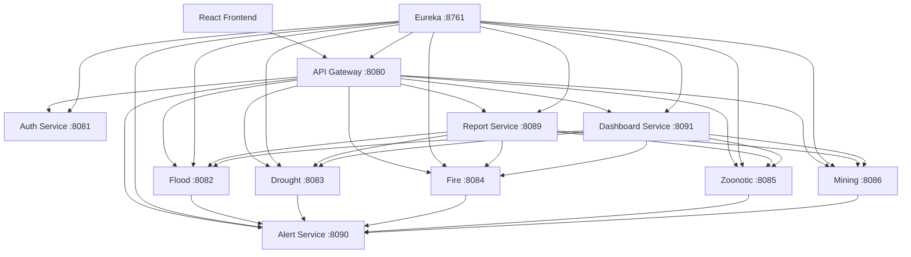

# Rushinga Provincial Disaster Monitoring and Management System (DPDMS)

## 1. Project purpose

DPDMS is a web-based, role-aware disaster monitoring platform for Rushinga. It captures ward-level incidents for floods, droughts, fires, zoonotic diseases, and mining accidents, routes incidents through hazard-specific approval workflows, exposes only approved data to the dashboard/map and reports, and dispatches asynchronous alerts.

## 2. Technology choice

- Backend: Spring Boot 4.1.1
- Java: 17
- Service-to-service platform: Spring Cloud 2025.1.3
- Service registry: Eureka Server
- API entry point: Spring Cloud Gateway
- Database: MySQL 8.4, one database per stateful service
- Frontend: React + Vite
- API documentation: springdoc OpenAPI / Swagger UI
- Reporting: CSV, XLSX, DOCX and PDF
- Alerting: JavaMail + WhatsApp Business Cloud API adapter
- Tests: JUnit/Spring Boot tests

React was selected because the dashboard needs reusable components, client-side routing/state handling and an interactive map while remaining a single consistent frontend technology across the application.

## 3. Architecture



## 4. Service ports

| Service | Port | Database |
|---|---:|---|
| discovery-service | 8761 | none |
| api-gateway | 8080 | none |
| auth-service | 8081 | dpdms_auth |
| flood-service | 8082 | dpdms_flood |
| drought-service | 8083 | dpdms_drought |
| fire-service | 8084 | dpdms_fire |
| zoonotic-service | 8085 | dpdms_zoonotic |
| mining-service | 8086 | dpdms_mining |
| report-service | 8089 | stateless |
| alert-service | 8090 | dpdms_alerts |
| dashboard-service | 8091 | stateless |
| React frontend | 5173 | none |

## 5. RBAC model

Roles are scoped as follows:

- `FLOOD_RECORDER`, `DROUGHT_RECORDER`, `FIRE_RECORDER`, `ZOONOTIC_RECORDER`, `MINING_RECORDER`: write/read only their own hazard and their own ward records.
- `*_SUPERVISOR`: approve/reject/request corrections only for their own hazard within the province.
- `NATIONAL_USER`: read-only access to approved incidents across all five hazards.
- `PROVINCIAL_ADMIN`: province-wide administrative access.

The gateway validates the signed JWT, removes any client-supplied identity headers, and injects identity headers from the verified token. Each hazard service independently verifies an internal gateway secret and re-enforces the hazard/ward rule. This prevents the frontend from being the security boundary.

## 6. Approval workflow

`PENDING -> APPROVED`

`PENDING -> REJECTED`

`PENDING -> CORRECTIONS_REQUESTED -> PENDING/APPROVED/REJECTED`

Every transition creates an audit record containing actor, role, action, previous status, new status, note and timestamp. Pending data is not exposed by the approved endpoints, dashboard, map or reports.

## 7. Alert policy used for the demo

These are project-defined thresholds used to demonstrate asynchronous alerting:

- Flood: peak water >= 5 m OR displaced households >= 50.
- Drought: rainfall deficit >= 50 mm OR water shortages >= 500 people OR livestock mortality >= 20.
- Fire: active AND (injury/fatality count > 0 OR area burned >= 10 ha).
- Zoonotic: cluster/outbreak AND (human cases >= 5 OR animal cases >= 10).
- Mining: fatalities > 0 OR trapped/injured miners >= 5 OR rescue is ongoing.

Without SMTP or WhatsApp credentials the application records `SIMULATED` alert deliveries; supplying real environment variables activates the real channels. No credentials are hard-coded.

## 8. OOP concepts demonstrated

- Encapsulation: domain fields remain private behind getters/setters.
- Inheritance: every hazard incident extends `BaseIncident` for the shared metadata model.
- Abstraction: `HazardRules`, `AlertChannel` and `ReportGenerator` define contracts.
- Polymorphism: concrete hazard rules, alert channels and report generators are selected through interfaces.
- Exceptions: domain exceptions and global REST handlers produce clear HTTP responses.
- DAO/repository pattern: Spring Data repositories separate persistence from business rules.
- Factory pattern: `AlertChannelFactory` and `ReportGeneratorFactory` select concrete implementations.
- Singleton: `ReportTemplateRegistry.INSTANCE` centralises the report template identity.

## 9. Prerequisites

Install Java 17, Maven 3.9+, Node.js 22+, Git, and either Docker Desktop or a local MySQL 8.4 server.

## 10. Database setup with Docker

```powershell
docker compose up -d mysql
```

The MySQL container executes the schema and seed SQL under `database/mysql` on first creation.

## 11. Start the backend

Open separate PowerShell terminals in the repository root.

```powershell
mvn -pl discovery-service spring-boot:run
mvn -pl auth-service spring-boot:run
mvn -pl flood-service spring-boot:run
mvn -pl drought-service spring-boot:run
mvn -pl fire-service spring-boot:run
mvn -pl zoonotic-service spring-boot:run
mvn -pl mining-service spring-boot:run
mvn -pl report-service spring-boot:run
mvn -pl alert-service spring-boot:run
mvn -pl dashboard-service spring-boot:run
mvn -pl api-gateway spring-boot:run
```

The gateway should be started after Eureka is available. Services can still start in parallel, but discovery is the first dependency to bring up.

## 12. Start the frontend

```powershell
cd frontend
npm install
npm run dev
```

Open `http://localhost:5173`.

## 13. Demo accounts

All seeded accounts use password `Password123!`.

Examples:

- `flood.recorder` / `Password123!`
- `flood.supervisor` / `Password123!`
- `drought.recorder` / `Password123!`
- `drought.supervisor` / `Password123!`
- `national.user` / `Password123!`
- `provincial.admin` / `Password123!`

Registration only creates a hazard-specific recorder; users cannot self-register as supervisors, national users or administrators.

## 14. Swagger / OpenAPI

For each backend service, open its Swagger UI, for example:

- `http://localhost:8082/swagger-ui/index.html`
- `http://localhost:8083/swagger-ui/index.html`
- `http://localhost:8084/swagger-ui/index.html`
- `http://localhost:8085/swagger-ui/index.html`
- `http://localhost:8086/swagger-ui/index.html`

## 15. Tests

```powershell
mvn clean test
```

Tests cover application/API startup plus the most important hazard-scope and read-only national-role rules. The integration tests use H2 test databases so they do not depend on MySQL.

## 16. GitHub workflow

Recommended workflow:

```powershell
git checkout -b complete-dpdms-build
git add .
git commit -m "Build complete DPDMS assignment solution"
git push -u origin complete-dpdms-build
```

Then open a pull request into `main` and merge after the CI workflow passes.

## 17. Deliverables included

- Five independently deployable hazard Spring Boot services.
- Auth, gateway and Eureka services.
- Dashboard/map service.
- Reusable report service with four output formats.
- Asynchronous alert service with email and WhatsApp adapters.
- MySQL schemas and seeds.
- React frontend.
- Swagger/OpenAPI support.
- Automated tests.
- Architecture and OOP documentation.
