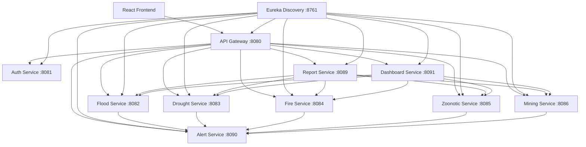

# Rushinga Provincial Disaster Monitoring and Management System (DPDMS)

## 1. Project Overview

The **Rushinga Provincial Disaster Monitoring and Management System (DPDMS)** is a web-based disaster monitoring and management platform developed for the monitoring, recording, approval, reporting and visualization of disaster incidents within Rushinga Province.

The system supports five major disaster/hazard categories:

1. Floods
2. Droughts
3. Fires
4. Zoonotic diseases
5. Mining accidents

DPDMS uses a role-based architecture. Ward-level users record incidents, supervisors review and approve incidents, and authorized provincial/national users access approved information through the dashboard, map and reporting functions.

The system is implemented as a collection of Spring Boot microservices with a React frontend.

---

# 2. Main System Features

The completed system provides:

* User authentication and JWT-based security
* Role-based access control (RBAC)
* Hazard-specific incident recording
* Ward-level data isolation
* Supervisor approval workflows
* Incident rejection and correction requests
* Audit trails for approval actions
* Province-wide and national approved-incident viewing
* Interactive dashboard
* Hazard monitoring/map functionality
* CSV report generation
* XLSX report generation
* DOCX report generation
* PDF report generation
* Asynchronous alert processing
* Email alert adapter
* WhatsApp alert adapter
* Demonstration/simulated alerts when external credentials are not configured
* Swagger/OpenAPI documentation
* Automated backend tests
* MySQL persistence
* Eureka service discovery
* Spring Cloud API Gateway
* React/Vite frontend

---

# 3. Technology Stack

| Technology             | Purpose                              |
| ---------------------- | ------------------------------------ |
| Java 17                | Backend programming language/runtime |
| Spring Boot 4.1.1      | Microservice development             |
| Spring Cloud 2025.1.3  | Microservice infrastructure          |
| Eureka Server          | Service discovery                    |
| Spring Cloud Gateway   | Central API gateway                  |
| MySQL 8.4              | Production database                  |
| Docker Desktop         | Database container                   |
| React                  | Frontend                             |
| Vite                   | Frontend development/build tool      |
| Maven                  | Java dependency and build management |
| Node.js/npm            | Frontend dependency management       |
| Git                    | Version control                      |
| GitHub                 | Project repository and collaboration |
| Swagger/OpenAPI        | API documentation                    |
| JUnit/Spring Boot Test | Automated testing                    |

---

# 4. System Architecture



---

# 5. Microservices and Ports

| Service           | Port | Purpose                                  | Database         |
| ----------------- | ---: | ---------------------------------------- | ---------------- |
| discovery-service | 8761 | Eureka service registry                  | None             |
| api-gateway       | 8080 | Central API entry point/security gateway | None             |
| auth-service      | 8081 | Authentication and users                 | `dpdms_auth`     |
| flood-service     | 8082 | Flood incident management                | `dpdms_flood`    |
| drought-service   | 8083 | Drought incident management              | `dpdms_drought`  |
| fire-service      | 8084 | Fire incident management                 | `dpdms_fire`     |
| zoonotic-service  | 8085 | Zoonotic incident management             | `dpdms_zoonotic` |
| mining-service    | 8086 | Mining incident management               | `dpdms_mining`   |
| report-service    | 8089 | Report generation                        | Stateless        |
| alert-service     | 8090 | Disaster alert processing                | `dpdms_alerts`   |
| dashboard-service | 8091 | Dashboard aggregation                    | Stateless        |
| frontend          | 5173 | React web interface                      | None             |

---

# 6. Project Structure

```text
dpdms-complete/
│
├── discovery-service/
├── api-gateway/
├── auth-service/
├── flood-service/
├── drought-service/
├── fire-service/
├── zoonotic-service/
├── mining-service/
├── report-service/
├── alert-service/
├── dashboard-service/
│
├── frontend/
│
├── database/
│   └── mysql/
│
├── scripts/
│   ├── run-all.ps1
│   └── stop-all.ps1
│
├── docker-compose.yml
├── pom.xml
├── .gitignore
└── README.md
```

---

# 7. Security and RBAC

DPDMS uses role-based access control.

## Hazard Recorders

The following roles are responsible for recording their respective hazards:

```text
FLOOD_RECORDER
DROUGHT_RECORDER
FIRE_RECORDER
ZOONOTIC_RECORDER
MINING_RECORDER
```

A recorder is restricted to the appropriate hazard and ward-level records.

## Hazard Supervisors

Supervisor roles approve, reject or request corrections for their respective hazards.

Examples:

```text
FLOOD_SUPERVISOR
DROUGHT_SUPERVISOR
FIRE_SUPERVISOR
ZOONOTIC_SUPERVISOR
MINING_SUPERVISOR
```

## National User

```text
NATIONAL_USER
```

The national user has read-only access to approved incidents across the supported hazards.

## Provincial Administrator

```text
PROVINCIAL_ADMIN
```

The provincial administrator has province-wide administrative access.

---

# 8. Security Architecture

The frontend is not treated as the security boundary.

The security flow is:

```text
User
  ↓
React Frontend
  ↓
API Gateway
  ↓
JWT Validation
  ↓
Verified User Identity
  ↓
Hazard Service
  ↓
Internal Gateway Verification
  ↓
Role/Ward Authorization
  ↓
Database
```

The API Gateway validates the signed JWT.

Client-supplied identity headers are not trusted.

The gateway removes untrusted identity information and injects verified identity information derived from the authenticated token.

Each hazard service additionally verifies the internal gateway secret and re-enforces the relevant hazard and ward authorization rules.

This provides defense in depth rather than relying on the frontend.

---

# 9. Incident Approval Workflow

Incidents follow a controlled approval workflow.

```text
PENDING
   │
   ├──> APPROVED
   │
   ├──> REJECTED
   │
   └──> CORRECTIONS_REQUESTED
              │
              └──> PENDING
```

An incident may therefore move through:

```text
PENDING → APPROVED
PENDING → REJECTED
PENDING → CORRECTIONS_REQUESTED → PENDING
```

Depending on the implemented workflow, a corrected incident can subsequently be approved or rejected.

Every approval action creates an audit record containing information such as:

* Actor
* Role
* Action
* Previous status
* New status
* Note
* Timestamp

Pending and rejected incidents are not exposed through the approved-incident dashboard/reporting paths.

---

# 10. Alert Thresholds

The following project-defined thresholds are used for demonstration purposes.

### Flood

An alert can be triggered when:

```text
Peak water level >= 5 metres
OR
Displaced households >= 50
```

### Drought

An alert can be triggered when:

```text
Rainfall deficit >= 50 mm
OR
People facing water shortages >= 500
OR
Livestock mortality >= 20
```

### Fire

An alert can be triggered when:

```text
Fire is active
AND
(injury/fatality count > 0 OR area burned >= 10 hectares)
```

### Zoonotic Disease

An alert can be triggered when:

```text
Cluster/outbreak
AND
(human cases >= 5 OR animal cases >= 10)
```

### Mining

An alert can be triggered when:

```text
Fatalities > 0
OR
Trapped/injured miners >= 5
OR
Rescue is ongoing
```

Without real SMTP or WhatsApp credentials, the application records simulated alert deliveries.

No external credentials are hard-coded into the repository.

---

# 11. OOP Concepts Demonstrated

The project demonstrates the major object-oriented programming concepts expected in the assignment.

## Encapsulation

Domain fields are kept private and accessed through appropriate methods.

## Inheritance

Common incident information is represented through shared base/domain structures where applicable.

## Abstraction

Interfaces define contracts for concepts such as:

```text
HazardRules
AlertChannel
ReportGenerator
```

## Polymorphism

Different hazard rules, alert channels and report generators can implement the same interfaces while providing different behavior.

## Exception Handling

Domain exceptions and global REST exception handlers provide meaningful HTTP responses.

## Repository/DAO Pattern

Spring Data repositories separate persistence operations from business logic.

## Factory Pattern

Factories such as:

```text
AlertChannelFactory
ReportGeneratorFactory
```

select appropriate concrete implementations.

## Singleton

The report template registry uses a centralized singleton instance where required by the project design.

---

# 12. Database Architecture

DPDMS uses MySQL 8.4.

The system uses separate databases for stateful services:

```text
dpdms_auth
dpdms_flood
dpdms_drought
dpdms_fire
dpdms_zoonotic
dpdms_mining
dpdms_alerts
```

The recommended development setup uses Docker Desktop.

The repository contains the database configuration and initialization material under:

```text
database/mysql
```

The MySQL database is exposed on:

```text
localhost:3306
```

---

# 13. Required Software

A computer running DPDMS should have the following installed:

1. Git
2. Java Development Kit 17
3. Maven 3.9 or later
4. Node.js 22 or later
5. npm
6. Docker Desktop
7. A modern web browser
8. A code editor such as Visual Studio Code

Windows PowerShell is used by the supplied automated startup and shutdown scripts.

---

# 14. Installation Resources

Use the official download pages for the required software.

### Git

Official Git download:

https://git-scm.com/downloads

### Java 17

A JDK 17 distribution such as Eclipse Temurin can be installed from:

https://adoptium.net/temurin/releases/?version=17

### Maven

Official Maven download:

https://maven.apache.org/download.cgi

### Node.js

Official Node.js download:

https://nodejs.org/en/download

### Docker Desktop

Official Docker Desktop download:

https://www.docker.com/products/docker-desktop/

### Visual Studio Code

Official Visual Studio Code download:

https://code.visualstudio.com/download

---

# 15. Verify the Required Tools

After installation, open PowerShell and run:

```powershell
java -version
```

The Java version should be 17.

Then:

```powershell
mvn -version
```

Maven should report Java 17.

Then:

```powershell
node -v
```

Then:

```powershell
npm -v
```

Then:

```powershell
git --version
```

Finally:

```powershell
docker --version
```

and:

```powershell
docker compose version
```

If all commands return version information, the required development tools are available.

---

# 16. Obtaining the Project

Clone the GitHub repository:

```powershell
git clone https://github.com/shebe-code/dpdms-complete.git
```

Enter the project:

```powershell
cd dpdms-complete
```

Open the project in Visual Studio Code:

```powershell
code .
```

---

# 17. First-Time Frontend Setup

The frontend dependencies only need to be installed the first time, or after the frontend dependency configuration changes.

Run:

```powershell
cd frontend
npm install
cd ..
```

This creates the local `node_modules` directory.

`node_modules` is not committed to GitHub.

---

# 18. First-Time Database Setup

Make sure Docker Desktop is installed and running.

From the project root:

```powershell
docker compose up -d mysql
```

Check that the container is running:

```powershell
docker ps
```

The expected container name is:

```text
dpdms-mysql
```

The database is available through:

```text
localhost:3306
```

Do not delete the Docker database volume unless you intentionally want to reset the project data.

---

# 19. Recommended One-Command Startup

The project includes:

```text
scripts/run-all.ps1
```

This script automatically:

1. Checks Docker Desktop.
2. Starts the DPDMS MySQL container.
3. Waits for MySQL to become healthy.
4. Starts Eureka.
5. Starts the authentication service.
6. Starts the hazard services.
7. Starts the reporting service.
8. Starts the alert service.
9. Starts the dashboard service.
10. Starts the API Gateway.
11. Starts the React frontend.
12. Records the started process IDs for safe shutdown.

From the project root run:

```powershell
powershell -ExecutionPolicy Bypass -File .\scripts\run-all.ps1
```

The main URLs are:

```text
Frontend: http://localhost:5173
Gateway:  http://localhost:8080
Eureka:   http://localhost:8761
```

Allow the services time to finish starting before testing the application.

---

# 20. Recommended One-Command Shutdown

The project includes:

```text
scripts/stop-all.ps1
```

From the project root run:

```powershell
powershell -ExecutionPolicy Bypass -File .\scripts\stop-all.ps1
```

The shutdown script:

* Stops the DPDMS backend services.
* Stops the DPDMS frontend.
* Stops related child processes.
* Stops the DPDMS MySQL container.
* Does not shut down Docker Desktop.
* Does not modify the Windows MySQL80 service.
* Does not intentionally terminate unrelated Java or Node applications.

This is the recommended way to stop the project after a demonstration or development session.

---

# 21. Complete Daily Operating Procedure

For a normal development or demonstration session:

## Step 1 — Start Docker Desktop

Open Docker Desktop and wait until Docker reports that it is running.

## Step 2 — Open PowerShell

Navigate to the repository:

```powershell
cd C:\Users\<YOUR_USERNAME>\Documents\GitHub\dpdms-complete
```

The exact path may differ on another computer.

## Step 3 — Start DPDMS

Run:

```powershell
powershell -ExecutionPolicy Bypass -File .\scripts\run-all.ps1
```

## Step 4 — Wait for startup

Wait for Eureka, backend services, gateway and frontend to finish starting.

## Step 5 — Open the application

Open:

```text
http://localhost:5173
```

## Step 6 — Log in

Use one of the seeded demonstration accounts listed below.

## Step 7 — Test the required workflow

Depending on the account:

* Record an incident.
* View the incident.
* Test approval/correction/rejection.
* Verify role restrictions.
* View approved information on the dashboard.
* Generate reports.
* Verify that restricted/pending/rejected information is not exposed through approved reporting paths.

## Step 8 — Stop the project

When finished:

```powershell
powershell -ExecutionPolicy Bypass -File .\scripts\stop-all.ps1
```

---

# 22. Demo Accounts

The seeded demonstration accounts use:

```text
Password123!
```

Example accounts include:

| Username             | Role                     |
| -------------------- | ------------------------ |
| `flood.recorder`     | Flood recorder           |
| `flood.supervisor`   | Flood supervisor         |
| `drought.recorder`   | Drought recorder         |
| `drought.supervisor` | Drought supervisor       |
| `national.user`      | National user            |
| `provincial.admin`   | Provincial administrator |

Registration creates an appropriate recorder account.

Users cannot simply self-register as supervisors, national users or administrators.

---

# 23. Swagger / OpenAPI

Swagger UI is available for the backend services.

Examples:

```text
http://localhost:8082/swagger-ui/index.html
http://localhost:8083/swagger-ui/index.html
http://localhost:8084/swagger-ui/index.html
http://localhost:8085/swagger-ui/index.html
http://localhost:8086/swagger-ui/index.html
```

Swagger provides an interactive way to inspect and test REST endpoints.

---

# 24. Testing

To execute the Maven test suite:

```powershell
mvn clean test
```

The automated tests cover important application behavior, API startup and security/authorization rules.

Integration tests use test databases where appropriate and should not require the development MySQL database for ordinary test execution.

---

# 25. Building the Backend

To build the complete Maven project:

```powershell
mvn clean install
```

A successful build should finish without Maven compilation errors.

Individual services can also be started manually.

For example:

```powershell
mvn -pl discovery-service spring-boot:run
```

or:

```powershell
mvn -pl drought-service spring-boot:run
```

The automated `run-all.ps1` script is recommended for normal demonstrations because it removes the need to manually open many terminals.

---

# 26. Manual Backend Startup

If the automated startup script is unavailable, services can be started individually.

From the project root:

```powershell
mvn -pl discovery-service spring-boot:run
mvn -pl auth-service spring-boot:run
mvn -pl flood-service spring-boot:run
mvn -pl drought-service spring-boot:run
mvn -pl fire-service spring-boot:run
mvn -pl zoonotic-service spring-boot:run
mvn -pl mining-service spring-boot:run
mvn -pl report-service spring-boot:run
mvn -pl alert-service spring-boot:run
mvn -pl dashboard-service spring-boot:run
mvn -pl api-gateway spring-boot:run
```

The React frontend can then be started using:

```powershell
cd frontend
npm run dev
```

---

# 27. Troubleshooting

## Docker is not running

If startup reports:

```text
ERROR: Docker Desktop is not running.
```

Open Docker Desktop, wait for it to become ready, then run:

```powershell
powershell -ExecutionPolicy Bypass -File .\scripts\run-all.ps1
```

---

## Port 3306 is already in use

Check:

```powershell
netstat -ano | findstr :3306
```

A common cause is another MySQL installation running as the Windows `MySQL80` service.

Check:

```powershell
Get-Service MySQL80
```

If a local MySQL server is already using port 3306, stop it before starting the DPDMS Docker database, provided it is not needed by another application.

Do not change or remove unrelated database installations without understanding what uses them.

---

## A backend service does not start

Check whether its port is already occupied.

For example:

```powershell
netstat -ano | findstr :8083
```

Replace `8083` with the affected service port.

Also inspect the service's PowerShell window for the actual Spring Boot error.

---

## Gateway does not work immediately

The API Gateway depends on service discovery.

After running the startup script, give Eureka and the backend services time to initialize before testing the gateway.

Open:

```text
http://localhost:8761
```

and check that the expected services have registered.

---

## Frontend does not load

Check:

```powershell
netstat -ano | findstr :5173
```

If the frontend is not listening, restart DPDMS using:

```powershell
powershell -ExecutionPolicy Bypass -File .\scripts\run-all.ps1
```

---

## Frontend dependencies are missing

Run:

```powershell
cd frontend
npm install
cd ..
```

Then restart the frontend.

---

## MySQL container is stopped

Check:

```powershell
docker ps
```

If `dpdms-mysql` is not listed, run:

```powershell
docker compose up -d mysql
```

or use the complete startup script.

---

# 28. Important Database Warning

Do not casually run commands that delete Docker volumes or databases.

For example, commands such as:

```powershell
docker compose down -v
```

may remove persistent database data depending on the Docker Compose configuration.

Only perform a database reset when deliberately preparing a fresh demonstration or development environment.

---

# 29. Git and GitHub Workflow

The repository is maintained on GitHub.

Before making changes:

```powershell
git pull origin main
```

Check the current state:

```powershell
git status
```

After making and testing changes:

```powershell
git status
```

Review the changes:

```powershell
git diff
```

Stage only the intended files:

```powershell
git add <file>
```

Commit with a clear message:

```powershell
git commit -m "Describe the change"
```

Push to GitHub:

```powershell
git push origin main
```

For larger feature work, a separate branch can be created:

```powershell
git checkout -b feature/my-change
```

After completing and testing the feature, it can be merged into `main`.

---

# 30. Recommended Team Workflow

Because DPDMS is a five-person group assignment, team members should avoid making unrelated changes to the same files simultaneously.

Before working:

```powershell
git pull origin main
```

After completing work:

```powershell
git status
git diff
```

Then commit and push the tested changes.

Team members should communicate which service or feature they are modifying.

The final `main` branch should contain only tested, working code.

---

# 31. Important Project Development Principle

The system should be tested before major commits are pushed.

The recommended cycle is:

```text
Edit
  ↓
Build
  ↓
Run
  ↓
Test
  ↓
Review git diff
  ↓
Commit
  ↓
Push
```

This reduces the risk of pushing broken code to the shared repository.

---

# 32. Final Demonstration Checklist

Before presenting the project, verify:

### Infrastructure

* [ ] Docker Desktop is running
* [ ] MySQL container starts
* [ ] MySQL becomes healthy
* [ ] Eureka starts
* [ ] All backend services start
* [ ] API Gateway starts
* [ ] Frontend starts

### Authentication

* [ ] Login works
* [ ] JWT authentication works
* [ ] Invalid credentials are rejected
* [ ] Role restrictions are enforced

### Incident Management

* [ ] Flood incidents can be recorded
* [ ] Drought incidents can be recorded
* [ ] Fire incidents can be recorded
* [ ] Zoonotic incidents can be recorded
* [ ] Mining incidents can be recorded

### Approval

* [ ] Pending incidents are created
* [ ] Supervisors can review appropriate incidents
* [ ] Approved incidents become visible through approved views
* [ ] Rejected incidents are excluded from approved views
* [ ] Correction requests work
* [ ] Audit information is recorded

### Dashboard

* [ ] Dashboard loads
* [ ] Hazard information is displayed
* [ ] Approved information is available
* [ ] Restricted information is not exposed

### Reports

* [ ] CSV report works
* [ ] XLSX report works
* [ ] DOCX report works
* [ ] PDF report works
* [ ] Rejected/pending information is not incorrectly included in approved reports

### Alerts

* [ ] Threshold rules can be triggered
* [ ] Alert processing works
* [ ] Simulated delivery works without external credentials

### Code Quality

* [ ] Maven build succeeds
* [ ] Tests pass
* [ ] Frontend production build succeeds
* [ ] No unnecessary credentials are committed
* [ ] Git working tree is clean before final submission

---

# 33. Assignment Deliverables

The project contains:

* Five independently deployable hazard microservices
* Authentication service
* API Gateway
* Eureka service discovery
* Dashboard service
* React frontend
* MySQL database configuration
* Database schemas/seeds
* Approval workflows
* Role-based access control
* Audit functionality
* Report generation
* Alert processing
* Swagger/OpenAPI documentation
* Automated tests
* OOP implementations
* Startup automation
* Shutdown automation
* Project documentation

---

# 34. Main URLs

When the complete system is running:

| Component         | URL                   |
| ----------------- | --------------------- |
| DPDMS Frontend    | http://localhost:5173 |
| API Gateway       | http://localhost:8080 |
| Eureka Dashboard  | http://localhost:8761 |
| Auth Service      | http://localhost:8081 |
| Flood Service     | http://localhost:8082 |
| Drought Service   | http://localhost:8083 |
| Fire Service      | http://localhost:8084 |
| Zoonotic Service  | http://localhost:8085 |
| Mining Service    | http://localhost:8086 |
| Report Service    | http://localhost:8089 |
| Alert Service     | http://localhost:8090 |
| Dashboard Service | http://localhost:8091 |

---

# 35. Quick Start

For an already configured computer, the normal workflow is simply:

```powershell
cd dpdms-complete
```

Start:

```powershell
powershell -ExecutionPolicy Bypass -File .\scripts\run-all.ps1
```

Open:

```text
http://localhost:5173
```

Use the system.

When finished:

```powershell
powershell -ExecutionPolicy Bypass -File .\scripts\stop-all.ps1
```

This is the recommended operating procedure for the completed DPDMS project.
